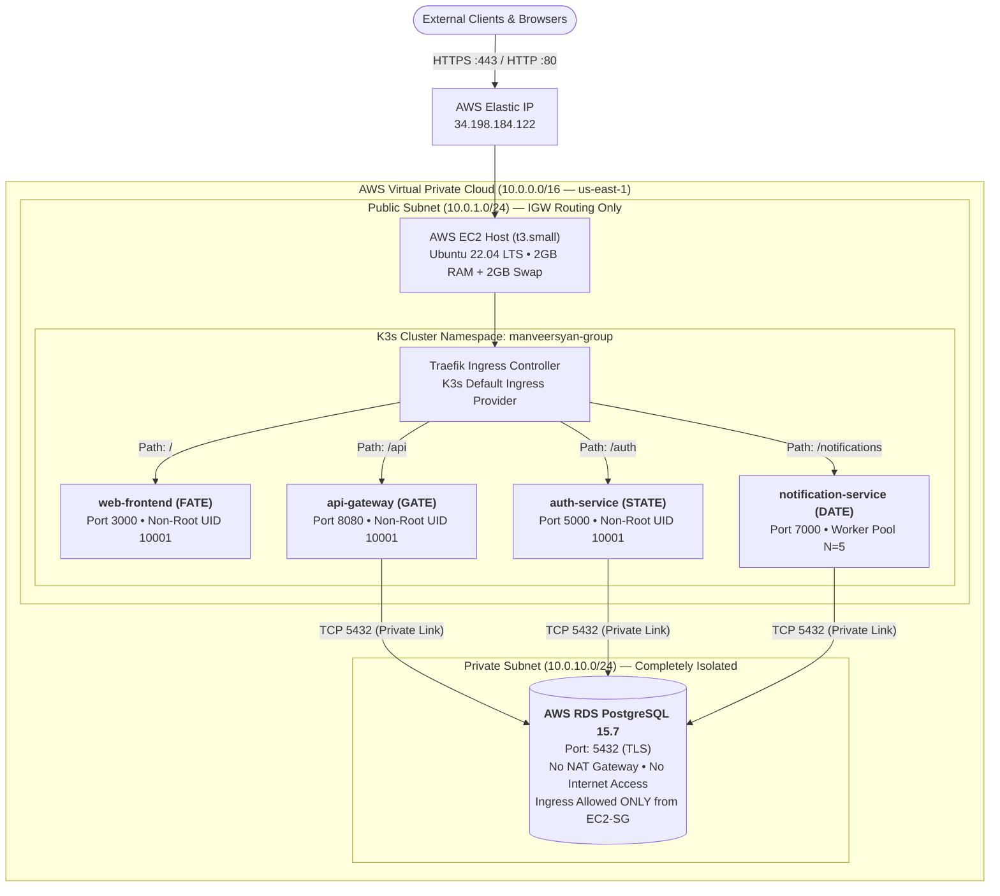
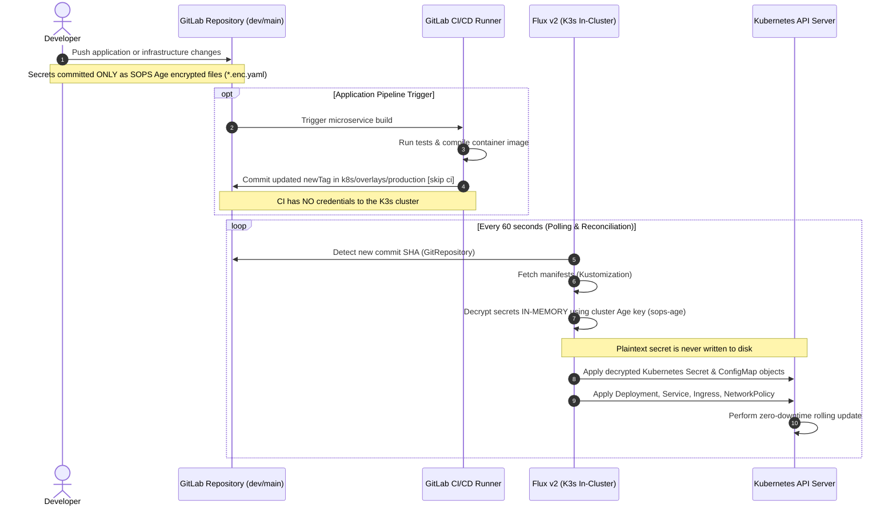

# Project ATE — Central Cloud Platform Infrastructure & GitOps Control Center

[](https://gitlab.com/manveersyan-group/ate)
[](https://opentofu.org/)
[](https://k3s.io/)
[](https://fluxcd.io/)
[](https://aws.amazon.com/)
[](https://www.postgresql.org/)
[](https://victoriametrics.com/)
[](https://github.com/getsops/sops)

---

## 1. Executive Summary & Architecture Principles

This repository (`manveersyan-group/ate`) is the **Single Source of Truth (SSoT)** for the cloud infrastructure, network topology, container orchestration, zero-trust secrets management, and automated pull-based GitOps reconciliation across the **Project ATE** microservice ecosystem.

### Core Architectural Decisions

1. **Lightweight Certified Kubernetes Engine**: Production runs on a single-node **K3s** cluster hosted on an **AWS EC2 `t3.small`** instance (2 vCPU, 2GB physical RAM, reinforced by a 2GB Linux swapfile to prevent OOM kernel panics).
2. **FinOps Cost Optimization (NAT Gateway Elimination)**: The AWS VPC topology is engineered without an AWS NAT Gateway. The EC2 host resides in a public subnet mapped to an Elastic IP, while the AWS RDS PostgreSQL database is isolated in private subnets with no internet egress. This yields a direct cloud infrastructure savings of ~$32.00 to ~$45.00/month.
3. **Strict Pull-Based GitOps**: **Flux v2** acts as the in-cluster GitOps operator. GitLab CI is restricted solely to image compilation, security scanning, container registry publishing, and updating target image tags in Git. CI holds **zero credentials** to the Kubernetes cluster API server.
4. **Zero-Plaintext-Secret Architecture**: All production secrets are committed exclusively as **Mozilla SOPS** Age-encrypted manifests (`secret.enc.yaml`). The in-cluster operator decrypts secrets **strictly in-memory** via **Flux v2 native SOPS provider**; plaintext secrets are never written to disk on developer workstations, CI runners, or cluster hosts.
5. **Memory-Conscious Observability**: Replaced Prometheus with **VictoriaMetrics** as the core time-series metrics scraper, drastically reducing memory overhead while maintaining complete Prometheus PromQL API compatibility with Grafana.
6. **Single-Node Operational Resilience**: PodDisruptionBudgets (`minAvailable: 2`) are decoupled into opt-in components and excluded from single-node production overlays to eliminate node-drain eviction deadlocks during maintenance.

---

## 2. Architecture & Topology Overview

### Microservice Ecosystem Matrix

| Identifier | Service Name | Source Repository | Language / Framework | Pod Port | Ingress Route | Protocol | Core Responsibility |
| :--- | :--- | :--- | :--- | :--- | :--- | :--- | :--- |
| **FATE** | `web-frontend` | [`manveersyan-group/fate`](https://gitlab.com/manveersyan-group/fate) | React / TypeScript SPA | `3000` | `/` | HTTP / JSON | Single-page UI, responsive dashboard, client routing |
| **GATE** | `api-gateway` | [`manveersyan-group/gate`](https://gitlab.com/manveersyan-group/gate) | Go (Golang) | `8080` | `/api` | REST / HTTP | API Gateway, route aggregation, rate limiting, DB queries |
| **STATE** | `auth-service` | [`manveersyan-group/state`](https://gitlab.com/manveersyan-group/state) | Go (Golang) | `5000` | `/auth` | REST / HTTP | Identity verification, bcrypt hashing, JWT issuance |
| **DATE** | `notification-service` | [`manveersyan-group/date`](https://gitlab.com/manveersyan-group/date) | Go (Worker Pools) | `7000` | `/notifications` | Async REST | Goroutine worker pools, OTP dispatch, email delivery |

### End-to-End Infrastructure & Ingress Topology



---

## 3. Enterprise GitOps & Secret Workflow (Flux v2 Native SOPS)

Project ATE operates on a **strict pull-based GitOps reconciliation model**. The deployment boundary between the CI build infrastructure and the runtime Kubernetes cluster is decoupled through Git commits.

### Pull-Based GitOps Architectural Sequence



### Zero-Plaintext-Secret Directives

* **Key Pair Generation**: Encryption is anchored to an **Age** public key (`age192pk2xs5v4dan3rl2hf4ex59m8v7wurj05gzvxpypwwlzc09kegsrc7cf7`).
* **Git Commit Boundary**: Only `.enc.yaml` files are tracked in Git. The root `.gitignore` enforces exclusion of any unencrypted secret manifests (`k8s/**/secret.yaml`).
* **Selective Encryption Regex**: The [`.sops.yaml`](file:///Users/manveersingh/projectATE/ate/.sops.yaml) specification applies `encrypted_regex: '^(data|stringData)$'`, ensuring metadata (`name`, `namespace`, `kind`) remains visible to Git diffs while sensitive payloads are encrypted with AES-256-GCM.
* **In-Cluster Key Injection**: The Age private key is injected directly into the cluster API server out-of-band as a Kubernetes Secret:
  ```bash
  cat ~/.config/sops/age/keys.txt | kubectl create secret generic sops-age \
    --namespace=flux-system \
    --from-file=age.agekey=/dev/stdin
  ```
* **Native In-Memory Decryption**: During synchronization, Flux's `kustomize-controller` utilizes its built-in SOPS decryptor (`spec.decryption.provider: sops`) with the `sops-age` secret to decrypt the native `Secret` manifests directly in memory without writing plaintext bytes to the node filesystem or requiring external generator plugins.

---

## 4. Repository Directory Structure

```text
.
├── .gitlab-ci.yml                         # Pull-based CI pipeline (validate, plan, deploy_tag_update)
├── .sops.yaml                             # Mozilla SOPS creation rules and Age recipient keys
├── Makefile                               # Automation shortcuts for IaC, Ansible, and Kubernetes
├── ansible/                               # Host OS configuration and security baseline
│   ├── ansible.cfg                        # Inventory settings and SSH connection parameters
│   ├── inventory/hosts.ini                # EC2 host definitions
│   ├── playbooks/
│   │   ├── security-hardening.yml         # UFW rules, fail2ban, SSH daemon hardening
│   │   └── update-apps.yml                # Standalone host maintenance
│   └── site.yml                           # Master orchestration playbook
├── docker-compose/                        # Local developer orchestration stack
│   ├── docker-compose.yml                 # Core services (Postgres, Mailpit, Nginx, App containers)
│   ├── docker-compose.monitoring.yml      # VictoriaMetrics and Grafana telemetry stack
│   ├── init.sql                           # Database schema and seed bootstrap
│   └── nginx/nginx.conf                   # Reverse proxy routing matching Traefik paths
├── docs/                                  # Architectural documentation & operator runbooks
│   ├── architecture/                      # Architecture Decision Records (ADRs)
│   │   ├── adr-001-ec2-docker-compose.md
│   │   └── adr-002-gitlab-ci-over-github-actions.md
│   └── runbooks/                          # Emergency and day-2 runbooks
│       ├── deploy-new-service.md
│       ├── disaster-recovery.md
│       └── rollback.md
├── gitops/                                # Declarative GitOps operator manifests
│   ├── flux/
│   │   └── ate-sync.yaml                  # Flux GitRepository & Kustomization with native SOPS decryption
│   └── argocd/
│       └── ate-application.yaml           # Alternative ArgoCD Application specification
├── k8s/                                   # Declarative Kubernetes manifests
│   ├── base/                              # Stateless, environment-agnostic templates
│   │   ├── namespace.yaml                 # Target namespace (manveersyan-group)
│   │   ├── kustomization.yaml             # Base aggregator
│   │   ├── ingress/ingress.yaml           # Traefik path-based routing rules
│   │   ├── web-frontend/                  # Deployment, Service, HPA
│   │   ├── api-gateway/                   # Deployment, Service, HPA
│   │   ├── auth-service/                  # Deployment, Service, HPA
│   │   └── notification-service/          # Deployment, Service, HPA
│   ├── components/                        # Modular, opt-in operational policies
│   │   ├── high-availability/             # Multi-node PodDisruptionBudgets (minAvailable: 2)
│   │   └── strict-network/                # Zero-trust NetworkPolicy (CoreDNS & RDS egress rules)
│   └── overlays/
│       └── production/                    # Production cloud overlay
│           ├── kustomization.yaml         # Master overlay combining base, components & secrets
│           └── apps/                      # Decoupled params and native SOPS-encrypted secrets
│               ├── web-frontend/          # params.env, secret.enc.yaml
│               ├── api-gateway/           # params.env, secret.enc.yaml
│               ├── auth-service/          # params.env, secret.enc.yaml
│               └── notification-service/  # params.env, secret.enc.yaml
├── observability/                         # Telemetry configuration assets
│   ├── grafana/
│   │   ├── dashboards/overview.json       # Unified platform dashboard
│   │   └── provisioning/                  # Automated datasource and dashboard providers
│   └── prometheus/                        # VictoriaMetrics / Prometheus scrape rules
│       ├── alerts.yml                     # Threshold alert definitions
│       └── prometheus.yml                 # Target scrape endpoints
├── scripts/                               # Operational utility scripts
│   └── sops-helper.sh                     # Zero-plaintext-disk SOPS editing and view helper
└── terraform/                             # OpenTofu Infrastructure as Code
    ├── backend.tf                         # S3 remote state and DynamoDB lock table
    ├── providers.tf                       # AWS provider configuration
    ├── environments/
    │   └── production/                    # Production environment root module
    └── modules/                           # Reusable architectural modules
        ├── ec2/                           # EC2 instance profile, IMDSv2, user_data
        ├── iam/                           # AWS SSM and CloudWatch instance roles
        ├── rds/                           # PostgreSQL 15.7 RDS with parameter groups
        ├── s3/                            # Encrypted state/log buckets with Glacier lifecycle
        ├── security_groups/               # EC2 and RDS firewall micro-segmentation
        └── vpc/                           # Cost-optimized dual-AZ VPC (No NAT Gateway)
```

---

## 5. Local Development Setup (Docker Compose)

The local development stack reproduces production routing, networking, and service contracts on developer workstations without requiring a local Kubernetes cluster.

### Architecture Parity Table

| Capability | Local Development (`docker-compose/`) | Production Cloud (`k8s/`) |
| :--- | :--- | :--- |
| **Ingress Routing** | Nginx Reverse Proxy (`:80`, `:443`) | K3s Traefik Ingress Controller |
| **Database** | Dockerized PostgreSQL 15 (`postgres:15-alpine`) | AWS RDS PostgreSQL 15.7 (Isolated Private Subnet) |
| **SMTP Testing** | Mailpit Mock Server (`:1025`, Web UI `:8025`) | Production SMTP Gateway |
| **Microservices** | Live mounted code / local container builds | K3s Deployments (`envFrom` ConfigMap/Secret) |
| **Telemetry** | VictoriaMetrics (`:9090`) + Grafana (`:3001`) | In-cluster VictoriaMetrics + CloudWatch |

### Running the Local Stack

1. **Navigate to the Docker Compose directory**:
   ```bash
   cd docker-compose
   ```
2. **Bootstrap the environment configuration**:
   ```bash
   cp .env.example .env
   ```
3. **Start the core application stack**:
   ```bash
   docker compose up -d --build
   ```
4. **(Optional) Launch the observability stack**:
   ```bash
   docker compose -f docker-compose.yml -f docker-compose.monitoring.yml up -d
   ```

### Local Endpoint Verification

* **Web UI (FATE)**: `http://localhost/`
* **API Gateway Health (GATE)**: `http://localhost/api/health`
* **Auth Service Health (STATE)**: `http://localhost/auth/health`
* **Notification Service Health (DATE)**: `http://localhost/notifications/health`
* **Mailpit Web Inspector**: `http://localhost:8025`
* **Grafana Dashboards**: `http://localhost:3001` (Credentials: `admin` / `AdminGrafanaSecure123!`)
* **VictoriaMetrics Metrics API**: `http://localhost:9090`

---

## 6. Infrastructure Provisioning (OpenTofu)

All AWS infrastructure is managed declaratively via **OpenTofu >= 1.6.0** (Terraform compatible).

### FinOps Network Architecture (No NAT Gateway)

To eliminate unnecessary AWS overhead, the VPC module operates without an AWS NAT Gateway:
* **Public Subnets (`10.0.1.0/24`, `10.0.2.0/24`)**: Bound to an Internet Gateway (`aws_internet_gateway`). Hosts the EC2 K3s node.
* **Private Subnets (`10.0.10.0/24`, `10.0.11.0/24`)**: Have no default route (`0.0.0.0/0`) attached. Houses the multi-AZ RDS PostgreSQL database.
* **Security**: The RDS instance is only reachable via TCP port 5432 from the EC2 security group (`ec2-sg`). Because RDS does not initiate outbound internet connections, eliminating the NAT Gateway improves network isolation at zero operational cost.

### Provisioning Steps

```bash
# 1. Navigate to the production environment
cd terraform/environments/production

# 2. Initialize OpenTofu plugins and remote S3 backend
tofu init

# 3. Validate syntax and structural integrity
tofu validate

# 4. Generate speculative execution plan
tofu plan -out=tfplan

# 5. Apply infrastructure changes
tofu apply tfplan
```

### Security & Compliance Controls

* **IMDSv2 Enforced**: EC2 metadata tokens require session tokens (`http_tokens = "required"`), neutralizing SSRF exploitation vectors.
* **Non-Root Pods**: Containers run with UID `10001`, `readOnlyRootFilesystem: true`, and all Linux capabilities dropped (`capabilities: drop: ["ALL"]`).
* **Strict NetworkPolicy**: All inter-namespace traffic is denied by default. Pods allow ingress from Traefik and egress strictly to CoreDNS (`kube-system` / `10.43.0.10:53`) and the VPC database subnet (`10.0.0.0/16:5432`).

---

## 7. Operator Runbooks & Makefile Commands

A unified [Makefile](file:///Users/manveersingh/projectATE/ate/Makefile) simplifies routine administrative operations.

### Makefile Command Reference

```bash
# OpenTofu Infrastructure Automation
make tf-init        # Initialize backend, download providers, and configure state locks
make tf-validate    # Run static syntax and configuration verification
make tf-plan        # Generate speculative execution plan
make tf-apply       # Provision or modify cloud resources (-auto-approve)

# Host Configuration Management
make ansible-play   # Execute master Ansible playbook against inventory hosts

# Kubernetes Orchestration
make k8s-apply      # Apply raw manifests (for break-glass manual overrides)
```

---

### Key Operational Runbooks

#### Runbook A: Bootstrapping Flux v2 with Out-of-Band Age Key

When initializing a fresh K3s cluster:

1. **Install lightweight Flux v2 controllers**:
   ```bash
   curl -s https://fluxcd.io/install.sh | sudo bash
   flux install \
     --namespace=flux-system \
     --components=source-controller,kustomize-controller
   ```
2. **Inject the Age private key out-of-band**:
   ```bash
   cat ~/.config/sops/age/keys.txt | kubectl create secret generic sops-age \
     --namespace=flux-system \
     --from-file=age.agekey=/dev/stdin
   ```
3. **Register the Git repository sync**:
   ```bash
   kubectl apply -f gitops/flux/ate-sync.yaml
   ```
4. **Monitor reconciliation status**:
   ```bash
   flux get kustomizations --watch
   ```

#### Runbook B: In-Memory Secret Inspection & Safe Editing

Use the zero-plaintext-disk helper script to manage SOPS encrypted files:

```bash
# View decrypted secret stream directly in stdout (never writes to disk)
./scripts/sops-helper.sh view k8s/overlays/production/apps/api-gateway/secret.enc.yaml

# Interactively edit encrypted values in-memory
./scripts/sops-helper.sh edit k8s/overlays/production/apps/auth-service/secret.enc.yaml

# Encrypt a newly created plaintext template
./scripts/sops-helper.sh encrypt-file plaintext.yaml k8s/overlays/production/apps/web-frontend/secret.enc.yaml
```

#### Runbook C: Emergency Application Rollback

If a newly deployed image tag introduces errors:

```bash
# Option 1: Revert the image tag commit in Git (Recommended GitOps method)
git revert HEAD --no-edit && git push origin dev

# Option 2: Break-glass immediate pod undo in K3s
kubectl rollout undo deployment/api-gateway -n manveersyan-group
kubectl rollout status deployment/api-gateway -n manveersyan-group
```

#### Runbook D: Cluster Node Maintenance & Upgrades

Because single-node clusters cannot satisfy `minAvailable: 2` PodDisruptionBudgets, the production overlay does not include the high-availability component. You can drain the node cleanly:

```bash
# 1. Cordon the node
kubectl cordon <node-name>

# 2. Drain workloads with pod eviction safety
kubectl drain <node-name> --ignore-daemonsets --delete-emptydir-data

# 3. Perform OS maintenance / kernel updates, then uncordon
kubectl uncordon <node-name>
```
