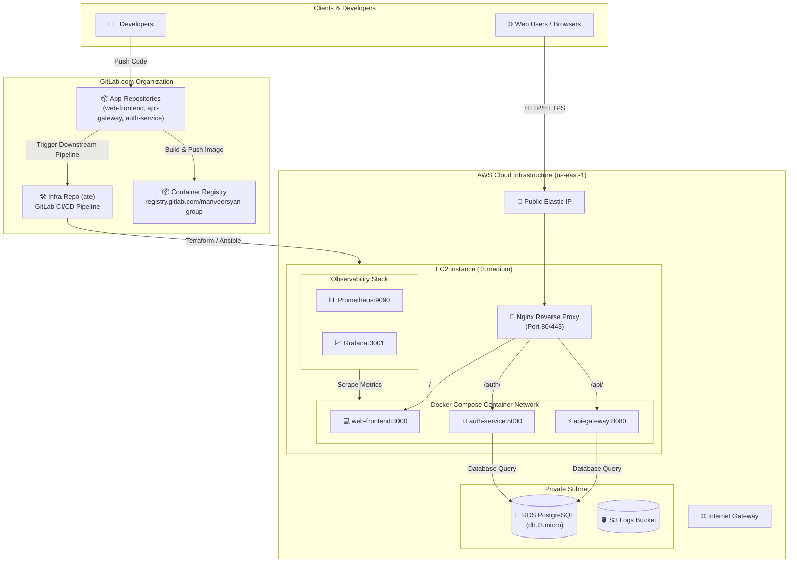

# 🚀 Central Infrastructure & GitOps Platform

[](https://gitlab.com/manveersyan-group/ate)
[](https://www.terraform.io/)
[](https://docs.docker.com/compose/)
[](https://www.ansible.com/)
[](https://aws.amazon.com/)

This repository (`manveersyan-group/ate`) serves as the **Central Platform Engineering & GitOps Repository** for the **`manveersyan-group`** organization on GitLab.

---

## 📐 Architecture & Traffic Flow



---

## 🛠️ Prerequisites

- **Terraform**: `>= 1.5.0`
- **AWS CLI**: `v2.x` configured with `us-east-1`
- **Docker & Docker Compose**: `v24.0+`
- **Git**: `>= 2.30`

---

## 🚀 Quick Start Guide

### 1. Configure AWS Environment Variables
```bash
export AWS_ACCESS_KEY_ID="your_aws_access_key"
export AWS_SECRET_ACCESS_KEY="your_aws_secret_key"
export AWS_DEFAULT_REGION="us-east-1"
```

### 2. Provision Production Infrastructure
```bash
cd terraform/environments/production
terraform init
terraform apply -auto-approve
```

### 3. Deploy Application Containers via Docker Compose
```bash
cd ../../../docker-compose
cp .env.example .env
./deploy.sh
```

---

## 🔑 Required Environment Variables

| Variable | Description | Example / Default |
| :--- | :--- | :--- |
| `REGISTRY_URL` | Container registry domain | `registry.gitlab.com/manveersyan-group` |
| `DATABASE_HOST` | RDS PostgreSQL endpoint | `manveersyan-prod-db.xxx.us-east-1.rds.amazonaws.com` |
| `DATABASE_NAME` | Primary database name | `appdb` |
| `DATABASE_USER` | Primary database user | `produser` |
| `DATABASE_PASSWORD` | Primary database password | `[Masked Secret]` |
| `JWT_SECRET` | 32-byte JWT secret | `[Masked Secret]` |

---

## 💳 Optimized Cost Breakdown (<$150/mo)

| Resource | Dev | Staging | Production | Monthly Cost |
| :--- | :--- | :--- | :--- | :--- |
| **EC2 Instance** | `t3.micro` ($8.50) | Shared | `t3.medium` ($30.00) | **$38.50** |
| **Elastic IP** | Free | Free | Free | **$0.00** |
| **NAT Gateway** | Public Subnet Only | Public Subnet Only | Single NAT Gateway ($32.00) | **$32.00** |
| **RDS Database** | `db.t3.micro` ($15.00) | Shared | `db.t3.micro` ($15.00) | **$30.00** |
| **S3 Storage** | ~1 GB ($0.02) | ~1 GB ($0.02) | ~1 GB ($0.02) | **$0.06** |
| **Data Transfer** | ~$5.00 | ~$5.00 | ~$10.00 | **$20.00** |
| **TOTAL** | | | | **~$120.56 / month** |

---

## 👥 Team Ownership
- **Lead Platform Engineer**: Manveer Singh (`manveersyan-group`)
- **Repository**: [`manveersyan-group/ate`](https://gitlab.com/manveersyan-group/ate)
