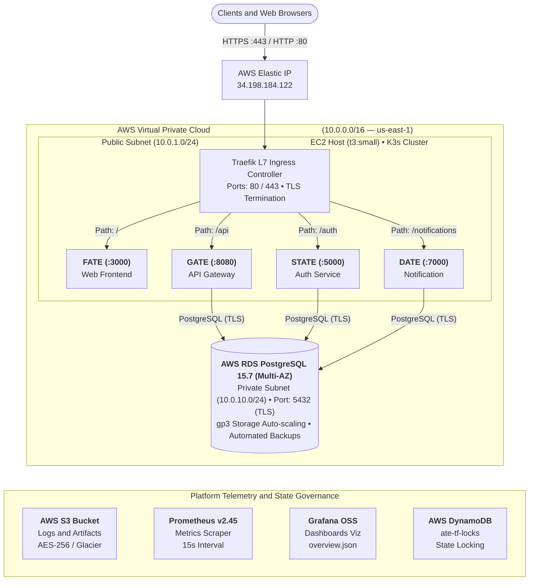
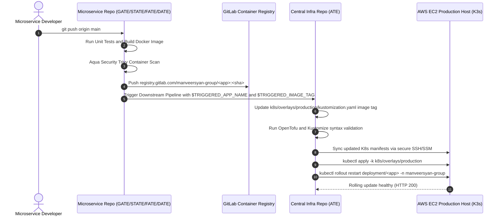

# Project ATE — Central Cloud Platform Infrastructure & GitOps Control Center

[](https://gitlab.com/manveersyan-group/ate)
[](https://opentofu.org/)
[](https://k3s.io/)
[](https://aws.amazon.com/)
[](https://www.postgresql.org/)
[](https://aquasecurity.github.io/trivy/)
[](https://prometheus.io/)

---

## 1. Executive Summary & System Architecture

This repository (`manveersyan-group/ate`) serves as the **Single Source of Truth (SSoT)** for the cloud infrastructure, network topology, container orchestration, GitOps automation, and DevSecOps governance across the entire **Project ATE** microservice ecosystem.

The platform employs a **hybrid orchestration model**:
- **Production Environment**: Cloud-native **K3s (Lightweight Certified Kubernetes)** running on an **AWS EC2** instance with declarative **Kustomize** layers, ingress routing, PodDisruptionBudgets, automated horizontal pod autoscaling (HPA), and zero-downtime rolling updates.
- **Local Development Environment**: Containerized **Docker Compose** stack with an Nginx reverse proxy mimicking production Traefik ingress paths, local Mailpit SMTP server, and live code mounts.

### Project ATE Microservice Ecosystem

```
+---------------------------------------------------------------------------------------------------------+
|                                      PROJECT ATE ECOSYSTEM ARCHITECTURE                                  |
+-------------------+--------------------+------------------------+-------------------+-------------------+
|     ATE (Infra)   |     GATE (API)     |      STATE (Auth)      |    FATE (Frontend)|    DATE (Notify)  |
+-------------------+--------------------+------------------------+-------------------+-------------------+
| Central GitOps,   | High-performance   | Identity, auth, JWT    | Web frontend:     | Asynchronous      |
| OpenTofu IaC,     | Go API Gateway,    | issuance/verification, | Go HTTP server +  | notification      |
| K3s Kubernetes,   | rate limiting,     | user management,       | embedded Vite/TS  | engine, Go worker |
| Ansible, Nginx,   | DB persistence,    | bcrypt password        | SPA, reverse      | pools, queue,     |
| CI/CD, Monitoring | CRUD routing       | security               | proxy router      | SMTP/Slack/Audit  |
| (Control Center)  | (:8080 -> /api/*)  | (:5000 -> /auth/*)     | (:3000 -> /*)     | (:7000 -> /notifications/*)
+-------------------+--------------------+------------------------+-------------------+-------------------+
```

---

## 2. Architectural Topology & Traffic Routing

### End-to-End Infrastructure Blueprint




---

## 3. Ingress Routing & Service Matrix

Traffic arriving at the AWS Elastic IP is routed by the **K3s Traefik Ingress Controller** (in production) or **Nginx** (in local development):

| Service Identifier | Upstream Microservice | Source Repo | Pod Port | Public Path Route | Prefix Stripped | Protocol | Authentication / Responsibility |
| :--- | :--- | :--- | :--- | :--- | :--- | :--- | :--- |
| **`web-frontend`** | `FATE` | [`manveersyan-group/fate`](https://gitlab.com/manveersyan-group/fate) | `3000` | `/` | No | HTTP / SPA | Vanilla TS SPA, static UI, same-origin API proxy |
| **`api-gateway`** | `GATE` | [`manveersyan-group/gate`](https://gitlab.com/manveersyan-group/gate) | `8080` | `/api` | Yes (`/api/(.*)` -> `/$1`) | REST / JSON | JWT-protected CRUD endpoints, item registry |
| **`auth-service`** | `STATE` | [`manveersyan-group/state`](https://gitlab.com/manveersyan-group/state) | `5000` | `/auth` | Yes (`/auth/(.*)` -> `/$1`) | REST / JSON | Bcrypt hashing (cost 12), JWT minting, login, registration |
| **`notification-service`** | `DATE` | [`manveersyan-group/date`](https://gitlab.com/manveersyan-group/date) | `7000` | `/notifications` | Yes (`/notification/(.*)` -> `/$1`) | REST / Async | Goroutine worker pools (N=5), channel queue, email/audit dispatch |
| **`ingress-health`** | Platform Edge | `ate` | Host | `/health` | N/A | Plaintext | Returns HTTP 200 OK edge health status |

---

## 4. Multi-Tier AWS Infrastructure (OpenTofu / Terraform)

Cloud infrastructure is declaratively managed with **OpenTofu >= 1.6.0** (fully Terraform-compatible) under `terraform/`.

```
terraform/
├── backend.tf                         # S3 backend definition + DynamoDB lock table
├── providers.tf                       # AWS provider configuration with retry limits
├── variables.tf                       # Global project parameter definitions
├── outputs.tf                         # Infrastructure endpoints and exported ARNs
├── environments/
│   ├── dev/                           # Staging / Development environment composition
│   │   ├── backend.tf
│   │   ├── main.tf
│   │   ├── outputs.tf
│   │   └── terraform.tfvars
│   └── production/                    # Production cloud composition
│       ├── backend.tf
│       ├── main.tf
│       ├── outputs.tf
│       ├── providers.tf
│       └── terraform.tfvars
└── modules/
    ├── vpc/                           # Dual-AZ VPC, subnets, IGW, NAT gateway, route tables
    ├── security_groups/               # Strict EC2 and RDS ingress/egress firewalls
    ├── ec2/                           # EC2 instance profile, swapfile setup, user_data
    ├── rds/                           # PostgreSQL 15.7 RDS with parameter group
    ├── s3/                            # Encrypted, versioned S3 bucket with Glacier lifecycle
    └── iam/                           # SSM, CloudWatch, and S3 IAM instance roles
```

### Module Breakdown & Architectural Specifications

#### 1. VPC & Networking (`modules/vpc`)
- **CIDR Block**: `10.0.0.0/16` with DNS hostnames and DNS support enabled.
- **Availability Zones**: `us-east-1a` and `us-east-1b`.
- **Public Subnets**: `10.0.1.0/24`, `10.0.2.0/24` (mapped to Internet Gateway, hosting EC2 and NAT Gateway).
- **Private Subnets**: `10.0.10.0/24`, `10.0.11.0/24` (isolated, hosting RDS multi-AZ subnet group).
- **NAT Gateway**: Single cost-optimized NAT Gateway allocated with an AWS Elastic IP for secure outbound private subnet routing.

#### 2. Security Groups & Micro-Segmentation (`modules/security_groups`)
- **EC2 Security Group (`ec2-sg`)**:
  - Ingress: HTTP (`80/tcp`) and HTTPS (`443/tcp`) from `0.0.0.0/0`.
  - Ingress: SSH (`22/tcp`) restricted to `var.allowed_ssh_cidr` (production defaults to AWS SSM Session Manager with zero public SSH exposure).
  - Ingress: Microservice ports (`3000`, `5000`, `7000`, `8080`) restricted to internal VPC CIDR (`10.0.0.0/16`).
  - Egress: Full outbound access (`0.0.0.0/0`) for container image pulls and OS updates.
- **RDS Security Group (`rds-sg`)**:
  - Ingress: PostgreSQL (`5432/tcp`) strictly allowed **ONLY** from `ec2-sg`. Direct internet access is structurally impossible.
  - Egress: Restricted strictly to VPC CIDR (`10.0.0.0/16`).

#### 3. Compute Host (`modules/ec2`)
- **Instance Sizing**: AWS EC2 `t3.small` (2 vCPU, 2GB physical RAM).
- **Memory Safety**: Automated creation of a **2GB Linux Swapfile** (`/swapfile`) via `user_data.sh.tpl`, ensuring stability and preventing Out-Of-Memory (OOM) kernel kills during container rollouts.
- **Instance Metadata Service**: Enforces **IMDSv2** (`http_tokens = "required"`, `http_put_response_hop_limit = 1`) to eliminate SSRF attack vectors.
- **Bootstrapping**: Cloud-init script installs Docker Engine, K3s, and clones the GitOps deployment repository.

#### 4. Relational Database (`modules/rds`)
- **Engine**: PostgreSQL `15.7` on `db.t3.micro` instance class.
- **Storage**: 20GB gp3 SSD auto-scaling up to 100GB.
- **Parameters**: Custom DB parameter group `pg15-params` with connection auditing (`log_connections=1`, `log_disconnections=1`).
- **Resilience**: 7-day automated backup retention, storage encryption enabled (KMS), IAM database authentication enabled, and Performance Insights enabled.

#### 5. Storage & State Governance (`modules/s3` & DynamoDB)
- **Log & State Bucket**: `manveersyan-production-logs-storage` with server-side AES256 encryption.
- **Object Lifecycle**: Automatically transitions stored logs and database dumps to AWS **S3 Glacier** after 30 days for cost reduction.
- **Public Access Block**: `block_public_acls`, `block_public_policy`, `ignore_public_acls`, `restrict_public_buckets` all set to `true`.
- **State Locking**: Remote OpenTofu state stored in S3 with atomic locks managed via DynamoDB table `ate-tf-locks`.

---

## 5. Container Orchestration Architectures

The platform implements two distinct container execution engines tailored for operational safety and developer velocity ([ADR 001](docs/architecture/adr-001-ec2-docker-compose.md)):

```
                     +---------------------------------------------+
                     |      ORCHESTRATION ARCHITECTURE CHOICE      |
                     +----------------------+----------------------+
                                            |
                    +-----------------------+-----------------------+
                    |                                               |
                    v                                               v
        +-----------------------+                       +-----------------------+
        |  Production Runtime   |                       |  Local Dev Runtime    |
        |  K3s Lightweight K8s  |                       |  Docker Compose Stack |
        +-----------------------+                       +-----------------------+
        | - Full K8s API        |                       | - Fast local startup  |
        | - Traefik Ingress     |                       | - Nginx reverse proxy |
        | - HPA / PDB / NetPol  |                       | - Mailpit SMTP mock   |
        | - Zero-downtime roll  |                       | - Sibling dir mounts  |
        | - ~500MB RAM overhead |                       | - Hot code reloading  |
        +-----------------------+                       +-----------------------+
```

### Production: Enterprise Zero-Plaintext-Secret Kubernetes (`k8s/`)

The platform implements an **Enterprise Zero-Plaintext-Secret GitOps Layout** using Kustomize components and KSOPS (Kustomize SOPS plugin) with Age key encryption. Plaintext secrets are **never** committed to Git or exported to local/CI disk.

```text
k8s/
├── base/                                  # Purely stateless, environment-agnostic manifests
│   ├── namespace.yaml                     # manveersyan-group isolated namespace
│   ├── kustomization.yaml                 # Base manifest aggregator
│   ├── ingress/
│   │   └── ingress.yaml                   # Traefik path-based Ingress rules
│   ├── web-frontend/                      # Deployment (ports, probes, envFrom), Service, HPA
│   ├── api-gateway/                       # Deployment (ports, probes, envFrom), Service, HPA
│   ├── auth-service/                      # Deployment (ports, probes, envFrom), Service, HPA
│   └── notification-service/              # Deployment (ports, probes, envFrom), Service, HPA
├── components/                            # Modular, opt-in operational policies
│   ├── high-availability/                 # PodDisruptionBudgets (minAvailable: 2)
│   └── strict-network/                    # Zero-trust Ingress/Egress NetworkPolicy
└── overlays/
    └── production/                        # Production Environment Overlay
        ├── kustomization.yaml             # Master overlay (base + components + KSOPS generators)
        └── apps/                          # App-decoupled configuration and KSOPS generators
            ├── web-frontend/              # params.env, secret.enc.yaml, secret-generator.yaml
            ├── api-gateway/               # params.env, secret.enc.yaml, secret-generator.yaml
            ├── auth-service/              # params.env, secret.enc.yaml, secret-generator.yaml
            └── notification-service/      # params.env, secret.enc.yaml, secret-generator.yaml
```

#### Zero-Trust Secret Management (KSOPS + Age)
- **Git Storage**: Secrets are stored exclusively as SOPS Age-encrypted manifests (`secret.enc.yaml`).
- **In-Cluster Decryption**: Pull-based GitOps operators (ArgoCD or Flux) hold the Age private key in a cluster Secret. During sync, the operator executes KSOPS (`viaduct.ai/v1`), decrypting `secret.enc.yaml` **strictly in-memory** and streaming Kubernetes Secret objects directly to the API server.
- **CI Pipeline Boundary**: The CI runner does **not** possess the SOPS Age key and executes **zero** secret decryption scripts.

#### Pod Security Hardening Standards
All production pods enforce enterprise DevSecOps policies in their container `securityContext`:
- `runAsNonRoot: true` (Runs under non-privileged UID `10001` and GID `10001`).
- `readOnlyRootFilesystem: true` (Prevents container-level disk tampering).
- `allowPrivilegeEscalation: false` (Prevents SUID privilege escalation).
- `capabilities: drop: ["ALL"]` (Strips all Linux kernel capabilities).
- `seccompProfile: type: RuntimeDefault` (Enforces Linux system call filtering).
- **Probes**: Explicit HTTP `livenessProbe` and `readinessProbe` checking `/health` endpoints.

#### Network Micro-Segmentation (`strict-network` component)
- **Ingress**: Pods reject all traffic except requests arriving from `kube-system` (Traefik Ingress) or same-namespace peers.
- **Egress**: Pods are blocked from arbitrary internet communication; egress is restricted to RDS PostgreSQL (`10.0.0.0/16:5432`), External HTTPS/HTTP (`:443`, `:80`), and CoreDNS (`UDP 53`).

---

### Local Development: Docker Compose Stack (`docker-compose/`)

Developers run the full multi-service stack locally without requiring a local Kubernetes cluster:

```bash
cd docker-compose
cp ../.env.example .env
docker compose up -d --build
```

#### Local Services Orchestrated
1. **`postgres`**: Local PostgreSQL 15 container auto-bootstrapped via `init.sql`.
2. **`mailpit`**: SMTP mock server listening on port `1025` with an interactive Web UI on `http://localhost:8025`.
3. **`nginx`**: Reverse proxy on `http://localhost:80` matching production Traefik path rules.
4. **`web-frontend`**, **`api-gateway`**, **`auth-service`**, **`notification-service`**: Microservices built dynamically from sibling repository directories (`../../gate`, `../../state`, `../../fate`, `../../date`).

---

## 6. GitOps, Multi-Project CI/CD & Automated Rollouts

The deployment architecture uses **GitLab CI/CD Native Multi-Project Pipelines** ([ADR 002](docs/architecture/adr-002-gitlab-ci-over-github-actions.md)):



### Central Infrastructure Pipeline (`.gitlab-ci.yml`)

The infrastructure pipeline executes across 3 automated stages:
1. **`validate`**:
   - `validate_iac`: Validates OpenTofu files using `tofu validate`.
   - `validate_k8s_manifests`: Validates Kustomize builds using `kubectl kustomize`.
   - `validate_ansible`: Performs syntax checks on Ansible playbooks (`ansible-playbook --syntax-check`).
   - `security_scan_iac`: Runs **Aqua Security Trivy** against all Terraform and Kubernetes files to detect misconfigurations.
2. **`plan`**:
   - Runs `tofu plan` on Merge Requests and branch updates to generate speculative execution logs.
3. **`deploy`**:
   - Updates target container image tag dynamically in `k8s/overlays/production/kustomization.yaml`.
   - Synchronizes manifests to the EC2 host via encrypted connection.
   - Executes `kubectl apply -k` and initiates zero-downtime rolling pod restart.

### Reusable Application Pipeline Component (`templates/app-pipeline.yml`)
Microservices (`gate`, `state`, `fate`, `date`) include this pipeline template to inherit standard build, scan, push, and downstream GitOps triggers automatically.

---

## 7. Configuration Management & OS Hardening (Ansible)

Host configuration, system packages, and kernel hardening are orchestrated via Ansible under `ansible/`:

```
ansible/
├── ansible.cfg                        # SSH timeout, host key checking, and inventory config
├── inventory/
│   └── hosts.ini                      # Target host definitions and IP mappings
├── site.yml                           # Master orchestration playbook
├── roles/
│   ├── common/                        # Base Linux packages, Docker installation, prerequisites
│   └── wire_apps/                     # Microservice container network wiring
└── playbooks/
    ├── security-hardening.yml         # OS hardening, UFW firewall, fail2ban, SSH policies
    └── update-apps.yml                # Standalone container refresh playbook
```

### Security Hardening Policies (`security-hardening.yml`)
- **UFW Firewall**: Default policy set to `incoming: deny`, `outgoing: allow`. Ingress strictly restricted to ports `22` (SSH), `80` (HTTP), and `443` (HTTPS).
- **SSH Daemon Hardening**: Disables remote root logins (`PermitRootLogin no`) in `/etc/ssh/sshd_config`.
- **Intrusion Prevention**: Activates **Fail2ban** daemon to monitor failed authentication attempts and dynamically drop malicious IP addresses.
- **Unattended Upgrades**: Configures `/etc/apt/apt.conf.d/20auto-upgrades` to automatically install critical security patches without manual intervention.

---

## 8. Observability, Telemetry & Alerting

The platform incorporates an integrated monitoring stack under `observability/`:

```
observability/
├── prometheus/
│   ├── prometheus.yml                 # Global scrape intervals and microservice targets
│   └── alerts.yml                     # Prometheus Alertmanager threshold rules
└── grafana/
    ├── provisioning/
    │   ├── datasources/datasource.yaml# Auto-configured Prometheus datasource
    │   └── dashboards/dashboard.yaml  # Dashboard provider definitions
    └── dashboards/
        └── overview.json              # Unified system performance & service dashboard
```

### Metrics Scraping Architecture
- Scrape interval: `15s` across all targets.
- Scraped endpoints:
  - `prometheus:9090`: Internal Prometheus engine health.
  - `node-exporter:9100`: Host-level CPU, RAM, disk I/O, and network bandwidth.
  - `web-frontend:3000/metrics`: HTTP latency, active websocket/HTTP connections.
  - `api-gateway:8080/metrics`: Request throughput, status code distributions, DB pool stats.
  - `auth-service:5000/metrics`: Authentication latency, JWT issue counts, DB latency.

### Prometheus Alerting Thresholds (`alerts.yml`)

| Alert Name | Metric Condition | Duration | Severity | Actionable Description |
| :--- | :--- | :--- | :--- | :--- |
| **`InstanceDown`** | `up == 0` | `5m` | Critical | Microservice or exporter instance is unresponsive |
| **`HighMemoryUsage`** | `container_memory_usage_bytes > 200MB` | `5m` | Warning | Container memory exceeds allocated safety margin |
| **`HighCpuUsage`** | `rate(container_cpu_usage_seconds_total[5m]) > 0.8` | `5m` | Warning | Container CPU exceeds 80% sustained utilization |
| **`Http5xxErrors`** | `rate(http_requests_total{status=~"5.."}[5m]) > 0.01`| `2m` | Critical | HTTP 5xx error rate exceeds 1% of total traffic |
| **`ServiceUnhealthy`** | `probe_success == 0` | `2m` | Critical | Liveness probe failure detected for 2 consecutive minutes |

---

## 9. DevSecOps, Compliance & Zero-Trust Governance

The infrastructure enforces strict security controls across all operational layers:

```
+-----------------------------------------------------------------------------------+
|                           DEVSECOPS MULTI-LAYER DEFENSE                           |
+---------------------+-------------------------------+-----------------------------+
| Cloud / Network     | Host / OS                     | Application / Runtime       |
+---------------------+-------------------------------+-----------------------------+
| - AWS SSM (No SSH)  | - UFW default deny            | - Aqua Trivy container scan |
| - Strict VPC SGs    | - Fail2ban jail enforcement   | - Non-root containers       |
| - S3 AES256 + Block | - Root login disabled         | - Read-only root filesystem |
| - IMDSv2 enforced   | - 2GB swap against OOM        | - Capabilities dropped      |
| - S3 DynamoDB Lock  | - Unattended security updates | - Kubernetes NetworkPolicy  |
+---------------------+-------------------------------+-----------------------------+
```

1. **Zero Public SSH (AWS Systems Manager)**: EC2 instances operate without exposing port 22 publicly. Operator sessions connect using authenticated IAM roles via the AWS SSM agent:
   ```bash
   aws ssm start-session --target <instance-id>
   ```
2. **Automated IaC Security Scanning**: GitLab CI runs Aqua Security **Trivy** and **Checkov** against all Terraform and Kubernetes definitions on every commit.
3. **Secret Governance**: All sensitive values (database passwords, JWT keys, registry secrets) are injected as masked, protected variables in GitLab CI (`scripts/setup-gitlab-variables.sh`) or managed via Kubernetes Secrets. No credentials are committed to version control.

---

## 10. FinOps: Cloud Cost Optimization Model

Infrastructure sizing is engineered to maintain total monthly AWS cloud spend strictly under **$50.00 / month**:

| Cloud Resource | Resource Configuration | Network Subnet | Scaling Strategy | Estimated Monthly Cost |
| :--- | :--- | :--- | :--- | :--- |
| **EC2 Application Host** | `t3.small` (2 vCPU, 2GB RAM + 2GB Swap) | Public (`10.0.1.0/24`) | Single node K3s with HPA pod autoscaling | ~$15.00 |
| **Elastic IP** | Static Public IPv4 Allocation (`34.198.184.122`) | VPC Level | Attached to active EC2 host | $0.00 |
| **RDS PostgreSQL** | `db.t3.micro` (PostgreSQL 15.7, 20GB gp3) | Private Subnet Group | gp3 auto-scaling to 100GB as needed | ~$15.00 |
| **NAT Gateway** | Single AWS NAT Gateway + EIP | Public (`10.0.1.0/24`) | Consolidated egress for private subnets | ~$10.00 |
| **S3 Object Storage** | Encrypted Log & State Bucket | Object Store | 30-day auto-transition to AWS Glacier | ~$0.06 |
| **Total Cloud Run-Rate** | | | | **~$40.06 / month** |

---

## 11. Operational Runbooks & Disaster Recovery

Comprehensive operational runbooks are maintained under `docs/runbooks/`:

### 1. Emergency Application Rollback ([`docs/runbooks/rollback.md`](docs/runbooks/rollback.md))
If a newly pushed microservice version causes runtime errors:
```bash
# Roll back specific deployment to its previous stable revision
kubectl rollout undo deployment/web-frontend -n manveersyan-group
kubectl rollout undo deployment/api-gateway -n manveersyan-group
kubectl rollout undo deployment/auth-service -n manveersyan-group
kubectl rollout undo deployment/notification-service -n manveersyan-group

# Monitor rollout status
kubectl rollout status deployment/api-gateway -n manveersyan-group
```

### 2. Infrastructure Disaster Recovery ([`docs/runbooks/disaster-recovery.md`](docs/runbooks/disaster-recovery.md))
- **RPO (Recovery Point Objective)**: 24 hours (automated daily RDS snapshots + S3 versioning).
- **RTO (Recovery Time Objective)**: 30 minutes (complete cloud reconstitution from IaC).
```bash
# Recreate complete cloud infrastructure from clean state
cd terraform/environments/production
tofu init
tofu apply -auto-approve

# Restore database from point-in-time snapshot
aws rds restore-db-instance-to-point-in-time \
  --source-db-instance-identifier manveersyan-prod-db \
  --target-db-instance-identifier manveersyan-prod-db-restored \
  --use-latest-restorable-time

# Re-apply Kubernetes manifests
kubectl apply -k k8s/overlays/production
```

### 3. Deploying a New Microservice ([`docs/runbooks/deploy-new-service.md`](docs/runbooks/deploy-new-service.md))
Follow the standard 5-step onboarding guide to add a new microservice to K3s manifests, ingress routes, and CI/CD pipelines.

---

## 12. Operator Quick Reference & Makefile Shortcuts

```bash
# OpenTofu Infrastructure Commands
make tf-init        # Initialize OpenTofu working directory
make tf-validate    # Validate syntax across all Terraform modules
make tf-plan        # Generate speculative execution plan
make tf-apply       # Provision cloud resources on AWS

# Configuration Management
make ansible-play   # Execute master Ansible playbook on target hosts

# Kubernetes Orchestration
make k8s-apply      # Apply Kustomize production manifests to K3s cluster
```

### Direct CLI Commands
```bash
# Connect to Production Host via AWS SSM
aws ssm start-session --target <EC2_INSTANCE_ID>

# Check K3s Cluster Status
kubectl get nodes -o wide
kubectl get pods -n manveersyan-group -o wide
kubectl get ingress -n manveersyan-group
kubectl top pods -n manveersyan-group

# View Live Application Logs
kubectl logs -n manveersyan-group -l app=api-gateway -f
kubectl logs -n manveersyan-group -l app=auth-service -f
kubectl logs -n manveersyan-group -l app=notification-service -f
kubectl logs -n manveersyan-group -l app=web-frontend -f
```

---

## 13. Engineering Ownership & Architecture Decision Records

- **Platform Engineering Team**: `manveersyan-group`
- **Infrastructure Repository**: [manveersyan-group/ate](https://gitlab.com/manveersyan-group/ate)
- **Architecture Decision Records (ADRs)**:
  - [ADR 001: Selection of K3s Lightweight Kubernetes on EC2 over EKS](docs/architecture/adr-001-ec2-docker-compose.md)
  - [ADR 002: Selection of GitLab CI/CD over GitHub Actions](docs/architecture/adr-002-gitlab-ci-over-github-actions.md)
